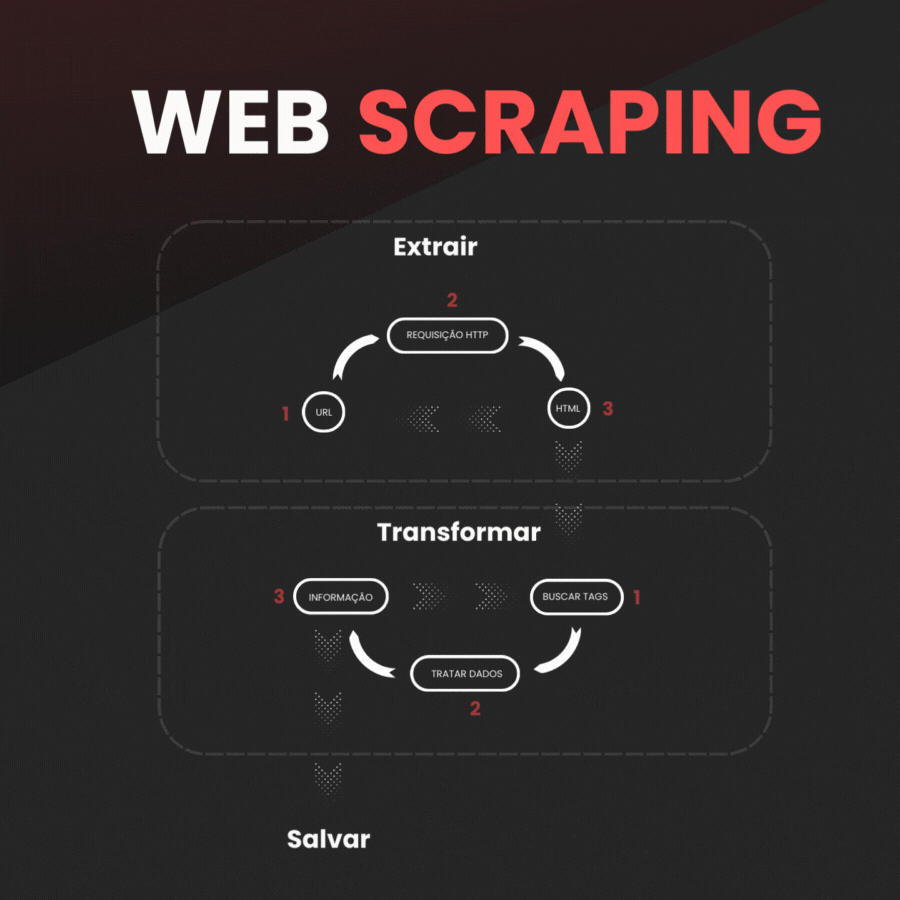

# ETL SCRAPPER

### Introdução
Esse repositório tem o objetivo de exemplificar o funcionamento 
de um webscrapper, utilizando o padrão ETL (Extrair, Trasnformar e Salvar.)

### Considerações
Neste repositório os dados coletados foram do ecommerce Aliexpress.


### Estrutura
#### Extrator
O objetivo do extrator é realizar requisições http do tipo get,
e caso a resposta da requisição seja satisfatória retorna o html
recebido.

#### Transformador
A função do transformador é refinar os dados. 
Esse componente recebe um dado bruto, html, e então busca as informações
contidas nele.
Nesse caso específico, o transformador busca no html as informações:
1. Nome da loja
2. Preço
3. Link do produto
4. Link da imagem
5. Descrição
Na sequência, retorna essas informações estruturada no formato de dicionário.

#### Salvar
Por fim, quando esses dados estão finalmente refinados, eles podem ser
salvos em um banco de dados ou planilha, como neste exemplo.

#### Crawler
É o orquestrador dos componentes (Extrator, Transformador e Salvar).
Esse componente define políticas da extração de dados, como:
1. Páginas que serão coletadas
2. Tempo entre requisições

### Como utilizar esse scrapper?
#### Baixe o repositório
```bash
git clone https://github.com/DiogoThomaz/ETL-Scrapper.git
```
#### Instalação dos requisitos
```bash
cd ETL-Scrapper

#WINDOWS
python -m venv venv
.\venv\Scripts\activate
pip install -r requeriments.txt

#LINUX
python3 -m venv venv
source venv/bin/activate
pip3 install -r requeriments.txt
```
#### Scrapper
No arquivo app.py
```python
from src.crawler.app import AliCrawler


# ALTERE ESSAS CONSTANTES
PRODUTO = 'placa de vídeo' #NOME DO PRODUTO
TEMPO_ENTRE_REQUISICOES = 1 #SEGUNDOS


# EXECUTE O SCRAPPER
crawler = AliCrawler(
    PRODUTO,
    TEMPO_ENTRE_REQUISICOES
    )
crawler.colect_firt_50_pages()
```


